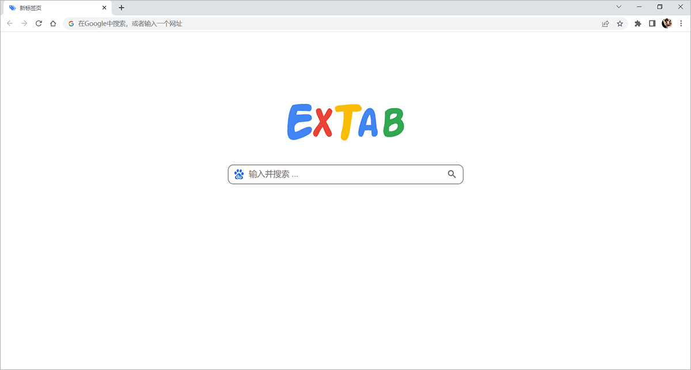

<h1 align="center">ExTab 新标签页</h1>

一款极简设计的浏览器新标签页扩展程序。

## 介绍

1. 极简设计，内存占用少，运行速度快；
2. 替换默认新标签页，专注于搜索功能本身。

## 页面展示

## 使用方法

1. 在 [Releases](https://github.com/yuhext/extab/releases/latest) 中下载最新版本扩展程序的压缩包 `ExTab_vx.x.x.zip`，解压到特定文件夹 (不要移动该位置)；
2. 打开 **Chrome**，点击扩展图标，选择 **管理扩展程序**，并打开 **开发者模式**；
3. 点击 **加载已解压的扩展程序**，选择扩展程序解压的文件夹，然后打开新标签页后会弹出窗口，选择 **保持现状**。

## 使用许可

[MIT](LICENSE) © Yuhext